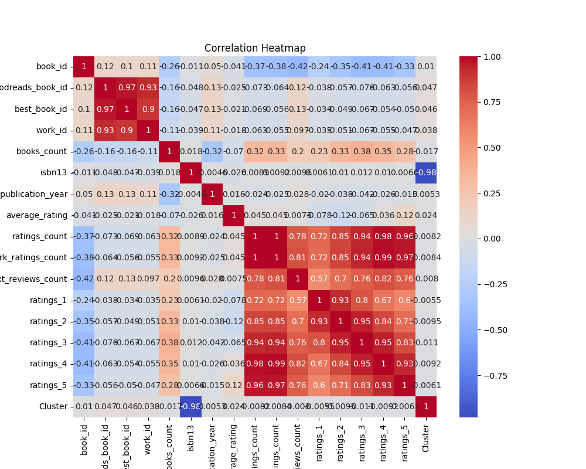
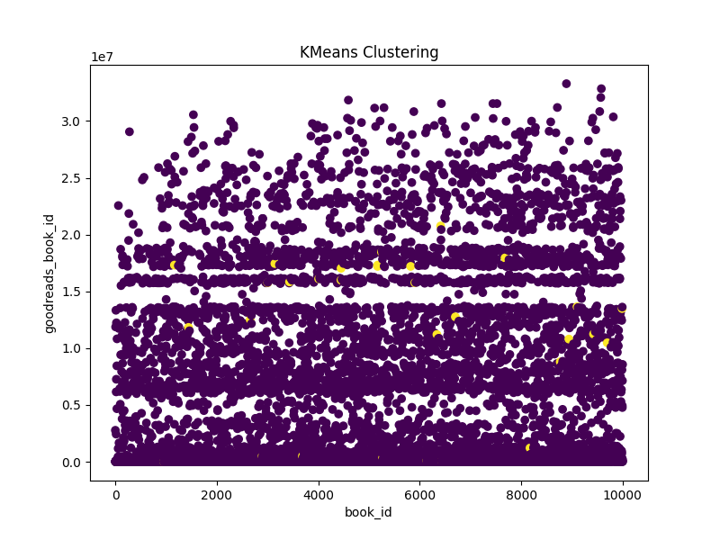
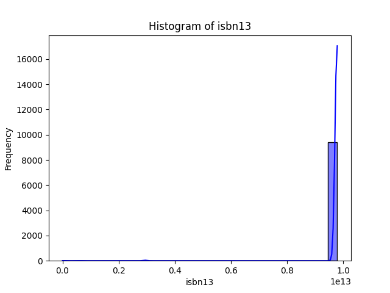

 # Analysis Report on the Goodreads Dataset

## Introduction

The dataset 'goodreads.csv' encompasses a wealth of information about books, their ratings, and the authorial landscape as captured by the Goodreads community. This analysis dives into various dimensions of the data, including its structure, statistical properties, correlations, and potential insights it may offer regarding user engagement and preferences.

## Dataset Overview

The dataset comprises **10,000 rows** and **23 columns**. Each row represents a book, and the columns include identifiers, ratings, publication details, and links to images. The following is a snapshot of key features:

- **Identifiers:** book_id, goodreads_book_id, best_book_id
- **Authors and Titles:** authors, original_title, title
- **Publication Year:** original_publication_year
- **Ratings:** average_rating, ratings_count, work_ratings_count
- **Rating Breakdown:** ratings_1 to ratings_5
- **Visuals:** image_url, small_image_url

### Summary Statistics

The summary statistics reveal interesting trends and distributions:

- The **average rating** of books hovers around **3.8** but exhibits substantial variability, as indicated by standard deviations across rating columns (particularly in ratings_5).
- The **ratings count** range illustrates a heavy skew, with a maximum of approximately **3 million ratings** for a single book.
- A closer look at the **publication statistics** reveals that earlier publications dominate the list in terms of numbers, with years stretching back multiple decades.

### Missing Values

Conclusively, certain columns harbor missing values:
- **ISBN:** 700 missing entries
- **ISBN13:** 585 missing entries
- **Language Code:** 1,084 missing entries
- **Original Publication Year:** 21 missing entries

These omissions necessitate methods for handling missing data, such as imputation or exclusion when analyzing particular facets of the dataset.

### Data Types and Duplicates

The dataset exhibits a mix of data types:
- Numeric columns (e.g., ratings_count, work_text_reviews_count)
- Categorical columns (e.g., authors, titles)
There are **no duplicates** in this dataset, ensuring unique representations for each book.

### Correlation Insights 

The correlation matrix highlights several intriguing relationships:
- Ratings notably correlate with each other, particularly the **higher ratings (4 and 5),** which are persistently aligned (correlation coefficients >0.9).
- **Ratings_count** and **work_ratings_count** show very high positive correlation, suggesting that books garnering larger readerships often receive more extensive ratings, thus reinforcing their visibility.
- On the contrary, **books_count** displays a negative correlation with multiple rating columns, suggesting that as the number of books increases (possibly implying lesser-known authors), average ratings tend to decline.

### Outliers

User engagement has a marked presence of outliers, particularly concerning ratings:
- **goodreads_book_id:** 345
- **average_rating:** 158, indicating remarkably high or low user-sourced appraisals that may merit deeper investigation.

## Clustering Analysis

The K-means clustering identified two distinct clusters, with one cluster capturing **9969 books** while another comprises a mere **31 books**. This indicates that the majority of books fit into a specific profile, with a tiny fraction representing less common traits or distinctive features worth exploring further.

## Observations and Insights

1. **User Engagement:** The dataset suggests that highly rated books attract a significant number of users, which implies that positive experiences lead to increased visibility. Authors and publishers should prioritize engaging with and promoting books that demonstrate high ratings.
   
2. **Book Popularity:** The trends showing negative correlations between book count and ratings hint at market saturation. New authors may find it increasingly challenging to stand out, emphasizing the need for effective marketing strategies.

3. **Missing Data:** The substantial amount of missing data in language codes and ISBN indicates potential barriers for users seeking bilingual editions or particular formats. Improving data collection methods may enhance future analyses.

4. **Diversity in Publication Years:** The data showcases a diverse range of publication years, highlighting the long-lasting nature of many literary works and the enduring interest from readers, which showcases the importance of well-established authors amid new entries.

## Conclusion

The 'goodreads.csv' dataset serves as a microcosm of the literary world, reflecting reader preferences and trends over time. Key findings reveal correlations between ratings and readership, the challenges for emerging authors in crowded markets, and significant data gaps that pose challenges for comprehensive analyses.

Moving forward, publishers and authors should consider these findings in their marketing and engagement strategies, ensuring that unique voices can still find a platform in the vast ocean of literature. Additionally, improved data collection practices can equip researchers and stakeholders with better tools to understand and adapt to the ever-evolving landscape of reading culture.

## Visualizations

### Correlation Heatmap

### KMeans Clustering Plot

### Histogram of isbn13

