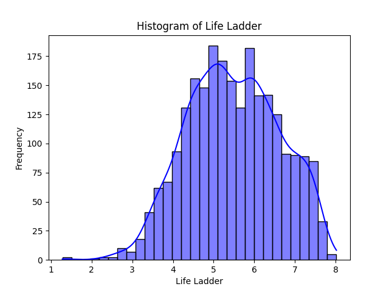

 # Analysis Report of the 'happiness.csv' Dataset

## Introduction

In our analysis of the `happiness.csv`, we explore the intricate relationships between various socio-economic factors and happiness levels represented by the "Life Ladder" score. This dataset, containing 2,363 rows and 11 columns, focuses on happiness indicators across different countries and years, offering valuable insights into the global landscape of well-being.

## Dataset Overview

### Structure and Content

The dataset comprises the following columns:

1. **Country name**: The name of the country.
2. **Year**: Year of data collection.
3. **Life Ladder**: A subjective measure of well-being.
4. **Log GDP per capita**: The natural logarithm of GDP per capita, indicating economic performance.
5. **Social support**: A measure of perceived social support.
6. **Healthy life expectancy at birth**: Indicator of health and longevity.
7. **Freedom to make life choices**: Reflects the degree of individual autonomy.
8. **Generosity**: A measure of charitable behavior.
9. **Perceptions of corruption**: Indicates perceived corruption in society.
10. **Positive affect**: Measures positive emotions.
11. **Negative affect**: Measures negative emotions.

### Summary Statistics

- The dataset reveals a mean "Life Ladder" score of **5.48**, indicating a moderate level of happiness internationally.
- The highest measured "Life Ladder" is **8.02**, while the lowest is **1.28**, showcasing significant disparities in happiness.
- Key economic indicators such as **Log GDP per capita** show a mean value of **9.40**, suggesting an overall positive economic status among the countries analyzed.
- Notably, the data contains missing values primarily in the columns for **Log GDP per capita**, **Social Support**, and **Generosity**, indicating that some socio-economic factors are not uniformly available.

### Data Quality

- The dataset holds **0 duplicates**, ensuring each record is unique.
- There are several missing values, notably in **Generosity** (81 missing entries) and **Perceptions of corruption** (125 missing entries), which could impact the overall analysis.

## Detailed Analysis

### Observations from Descriptive Statistics

After scrutinizing the dataset's summary statistics, it becomes apparent that countries display varied levels of happiness primarily influenced by factors such as economic performance (Log GDP per capita), social support, and individual freedoms. 

- The **Life Ladder** scores indicate that, generally, higher GDP per capita correlates with higher happiness levels. This is evident from a strong correlation (**correlation coefficient of 0.78**) between "Life Ladder" and "Log GDP per capita."
- Other noteworthy correlations include **Social support** (0.72) and **Freedom to make life choices** (0.54) contributing positively to the perceived quality of life.

### Correlation Insights

A closer examination of the correlation matrix reveals intriguing patterns:

- **Perceptions of corruption** have a negative correlation (-0.43) with happiness. Countries with higher levels of corruption perception tend to report lower happiness levels. 
- Conversely, **Generosity** exhibits a lesser but positive correlation (0.18) with happiness, indicating that societal altruism may have implications for overall well-being.
- A negative correlation exists between **Negative affect** (0.33) and happiness. Entities experiencing higher levels of negative emotions report lower happiness scores.

### Cluster Analysis

Through clustering analysis, the dataset reveals two distinct groups:
- One cluster consists of **1,653 observations** showcasing a typical range of happiness levels.
- The other group, with **710 observations**, appears to capture data from regions experiencing significantly higher or lower happiness levels, indicating outliers or unique socio-economic conditions.

### Outlier Detection

Certain columns, particularly **Perceptions of corruption** and **Social support**, present outliers. Understanding these exceptions may provide insights into unique socio-political contexts within specific countries.

## Insights and Implications

The analysis of the `happiness.csv` dataset illustrates that happiness is not solely a product of economic prosperity. Factors such as social support and perceptions of corruption play vital roles in shaping perceptions of well-being. 

- Policymakers should consider fostering social support networks and combating corruption to enhance happiness, especially as ethnocentric and socio-political factors significantly influence happiness in various regions.
- The positive correlation between generosity and happiness underscores the potential for community-oriented initiatives to bolster overall societal well-being and emotional health.

## Conclusion

In summary, this exploration of the `happiness.csv` dataset indicates that while economic factors are crucial, social dimensions significantly influence individual happiness. Countries should prioritize building strong community ties, reducing corruption, and increasing the general availability and access to resources that enhance quality of life. Addressing these factors may unlock the potential for elevated well-being, ultimately enhancing the happiness quotient on a global scale. These findings invite further investigation into tailored interventions designed to improve the socio-economic frameworks within which individuals live and thrive.

## Visualizations

### Correlation Heatmap

### KMeans Clustering Plot

### Histogram of Life Ladder

