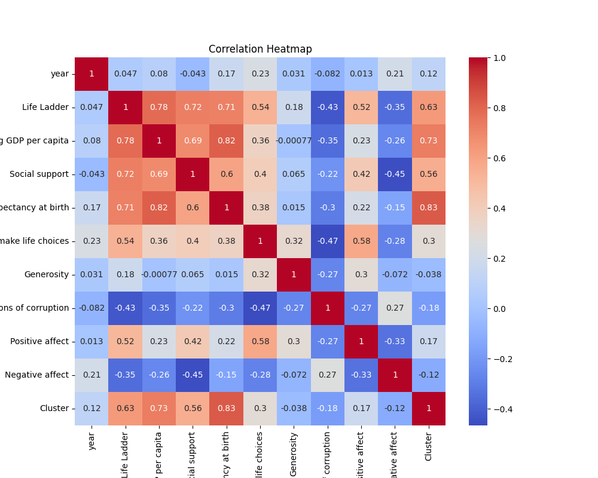
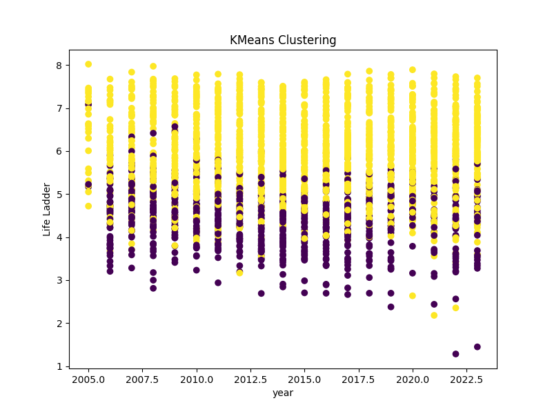
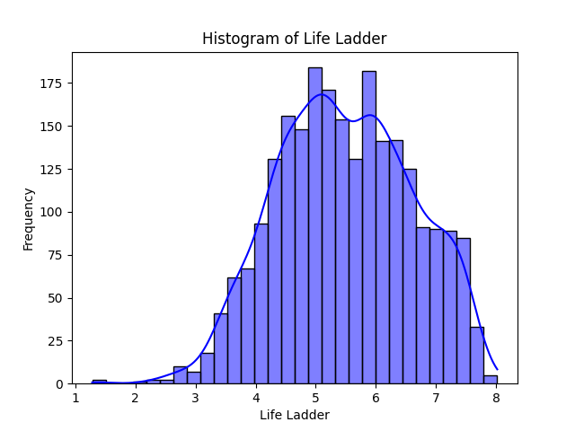

## Story generated using LLM

 # Analysis Report on the Dataset 'happiness.csv'

## Overview
The dataset 'happiness.csv' consists of 2363 rows and 11 columns. Each row represents a year of data corresponding to a specific country, calculating various factors determining happiness. The key metrics include the Life Ladder score, GDP per capita, social support, perceptions of corruption, and overall positive and negative affect.

## Summary of Columns
### Column Information
The columns of the dataset are:
- **Country name**: The name of the country.
- **year**: The year of data collection.
- **Life Ladder**: A measure of subjective well-being.
- **Log GDP per capita**: The logarithm of the GDP per capita.
- **Social support**: The perceived support one can rely on in times of need.
- **Healthy life expectancy at birth**: The average number of years a newborn is expected to live in good health.
- **Freedom to make life choices**: The degree of individual liberty.
- **Generosity**: The measure of giving to charity and support.
- **Perceptions of corruption**: A measure of the level of corruption perceived in each country.
- **Positive affect**: The measure of positive emotions experienced.
- **Negative affect**: The measure of negative emotions experienced.

### Data Types
The dataset contains mixed data types:
- `object`: Country name
- `int64`: Year
- `float64`: Life ladder and associated metrics.

## Summary Statistics
A summary of the key statistics is as follows:

| Metric                              | Mean        | Std Dev   | Min         | 25%        | 50%        | 75%        | Max        |
|-------------------------------------|-------------|-----------|-------------|------------|------------|------------|------------|
| Life Ladder                         | 5.48        | 1.13      | 1.28        | 4.65       | 5.45       | 6.32       | 8.02       |
| Log GDP per capita                 | 9.40        | 1.15      | 5.53        | 8.51       | 9.50       | 10.39      | 11.68      |
| Social support                      | 0.66        | 0.11      | 0.45        | 0.57       | 0.66       | 0.74       | 0.88       |
| Healthy life expectancy at birth    | 66.06       | 7.59      | 55.83       | 61.20      | 66.30      | 71.10      | 77.32      |
| Freedom to make life choices       | 0.56        | 0.19      | 0.35        | 0.42       | 0.66       | 0.73       | 0.91       |
| Generosity                          | 0.00        | 0.16      | -0.34       | -0.11      | -0.02      | 0.09       | 0.70       |
| Perceptions of corruption           | 0.74        | 0.18      | 0.04        | 0.69       | 0.80       | 0.87       | 0.98       |
| Positive affect                     | 0.65        | 0.11      | 0.18        | 0.57       | 0.66       | 0.74       | 0.88       |
| Negative affect                     | 0.27        | 0.09      | 0.08        | 0.21       | 0.26       | 0.33       | 0.71       |

### Missing Values
The dataset has some missing values across various columns:
- **Log GDP per capita**: 28 missing entries.
- **Social support**: 13 missing entries.
- **Healthy life expectancy at birth**: 63 missing entries.
- **Freedom to make life choices**: 36 missing entries.
- **Generosity**: 81 missing entries.
- **Perceptions of corruption**: 125 missing entries.
- **Positive affect**: 24 missing entries.
- **Negative affect**: 16 missing entries.

### Top 5 Rows
Sample data shows the following values for 'Afghanistan':

| Country name  | year | Life Ladder | Log GDP per capita | Social support | Freedom to make life choices | Generosity | Perceptions of corruption | Positive affect | Negative affect |
|---------------|------|-------------|---------------------|-----------------|------------------------------|------------|--------------------------|-----------------|-----------------|
| Afghanistan    | 2008 | 3.724       | 7.350               | 0.451           | 0.718                        | 0.164      | 0.882                    | 0.414           | 0.258           |
| Afghanistan    | 2009 | 4.402       | 7.509               | 0.552           | 0.679                        | 0.187      | 0.850                    | 0.481           | 0.237           |
| Afghanistan    | 2010 | 4.758       | 7.614               | 0.539           | 0.600                        | 0.118      | 0.707                    | 0.517           | 0.275           |
| Afghanistan    | 2011 | 3.832       | 7.581               | 0.521           | 0.496                        | 0.160      | 0.731                    | 0.480           | 0.267           |
| Afghanistan    | 2012 | 3.783       | 7.661               | 0.521           | 0.531                        | 0.234      | 0.776                    | 0.614           | 0.268           |

## Duplicates and Outliers
### Duplicates
The dataset contains no duplicate entries, ensuring uniqueness across the observations.

### Outliers
Outliers were detected in various columns:
- **Life Ladder**: 2 outliers noted.
- **Log GDP per capita**: 1 outlier observed.
- **Social Support**: 48 outliers detected.
- Other metrics show similar observations, indicating data points significantly divergent from the of respective means.

## Correlation Analysis
### Correlation Matrix
The correlation matrix shows notable relationships:
- **Log GDP per capita** and **Life Ladder** have a strong positive correlation (0.78).
- There is a significant correlation between **Social Support** and **Life Ladder** (0.72).
- **Freedom to make life choices** shows a positive correlation with **Life Ladder** (0.54).
- **Perceptions of corruption** displays a negative correlation with **Life Ladder** (-0.43), indicating higher corruption perceptions are associated with lower happiness levels.

### K-Means Clustering
Two clusters were identified through k-means analysis, providing insights into distinct happiness profiles observed in the dataset—likely categorizing countries into varying degrees of happiness based on the available metrics.

## Insights and Observations
1. **Economic Impact**: Higher GDP per capita correlates with greater happiness, affirming the economic foundation of subjective well-being.
2. **Social Support**: Social connectedness and support significantly contribute to the perceived happiness, as indicated by strong positive correlations.
3. **Corruption**: Higher perceptions of corruption negatively impact happiness, underscoring the importance of governance and social trust.
4. **Life Choices**: The ability to make personal life choices correlates positively with happiness, illustrating the need for individual freedoms in promoting well-being.

## Possible Implications
1. **Policy Development**: Governments can leverage this analysis to formulate policies that foster economic growth, reduce corruption, and enhance social welfare systems.
2. **Targeted Interventions**: Fostering social support structures, enhancing psychological well-being services, and improving healthy life expectancy could serve as effective strategies to enhance general happiness levels.
3. **Further Research**: Exploring the dataset for time-series analysis can yield insights into how these metrics evolve, providing deeper understanding into happiness dynamics over time.

In conclusion, this report highlights the intricate relationships between happiness determinants and emphasizes the importance of economic, social, and governance dimensions in cultivating well-being across nations.

## Relevant Charts

### Correlation Heatmap

### KMeans Clustering Plot

### Histogram of Life Ladder

