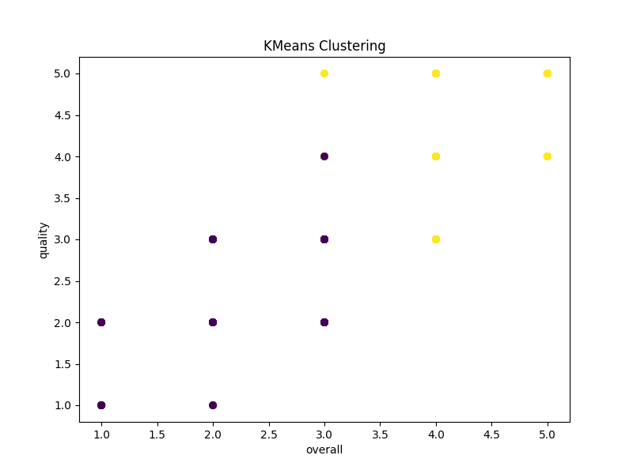

 # Detailed Report on the Analysis of the Dataset 'media.csv'

## Overview
The dataset 'media.csv' consists of 2,652 rows and 8 columns. This dataset presumably contains information about various media productions, specifically movies, categorized by their release dates, languages, and characteristics such as title, creators, ratings (overall quality), and repeatability of audience interest.

### Dataset Structure
- **Rows**: 2,652
- **Columns**: 8

### Column Information
The columns present in the dataset are:
1. **date**: The release date of the media.
2. **language**: The language in which the media is produced.
3. **type**: The type of media, which appears to be predominantly movies.
4. **title**: The title of the media.
5. **by**: The cast or creators of the media.
6. **overall**: A rating metric reflecting the overall enjoyment or quality as rated by the audience.
7. **quality**: A specific quality metric, likely corresponding to certain production values.
8. **repeatability**: Possibly indicates how often the audience would wish to revisit the media.

### Summary Statistics
The dataset contains the following summary statistics that provide insights into its structure and data:
- **Count of non-null entries** shows significant missing values in the columns `date` (99 missing) and `by` (262 missing).
- **Unique Entries**: Notable unique values include a total of 2,055 dates, 11 languages, 8 types, and 2,312 titles reported. The highest frequency entries reveal an inclination towards specific titles such as "Kanda Naal Mudhal."
- **Rating Metrics**: The `overall` ratings have a mean of approximately 3.05, a standard deviation of 0.76, and a range from 1.0 (lowest score) to 5.0 (highest score). The `quality` metric has a similar distribution with a mean of 3.21.

Additionally, `repeatability` scores, indicating how often media might be revisited, show a mean of about 1.49, suggesting that audiences may not frequently revisit the same media.

### Missing Values
- **Date Column**: 99 missing values (about 3.73%).
- **By Column**: 262 missing values (roughly 9.86%).
- The missing data could significantly impact the analysis, particularly any time series analyses or trends based on release dates.

### Top 5 Rows
The first five entries in the dataset depicts a selection of Tamil and Telugu films, all released in late 2024, showcasing a range of overall and quality ratings from 2 to 5.

|     | date       | language | type  | title           | by                           | overall | quality | repeatability |
|-----|------------|----------|-------|------------------|-------------------------------|---------|---------|---------------|
| 0   | 15-Nov-24  | Tamil    | movie | Meiyazhagan      | Arvind Swamy, Karthi       | 4       | 5       | 1             |
| 1   | 10-Nov-24  | Tamil    | movie | Vettaiyan        | Rajnikanth, Fahad Fazil    | 2       | 2       | 1             |
| 2   | 09-Nov-24  | Tamil    | movie | Amaran           | Siva Karthikeyan, Sai Pallavi | 4     | 4       | 1             |
| 3   | 11-Oct-24  | Telugu   | movie | Kushi            | Vijay Devarakonda, Samantha | 3       | 3       | 1             |
| 4   | 05-Oct-24  | Tamil    | movie | GOAT             | Vijay                        | 3       | 3       | 1             |

### Data Types
The data types in the dataset are characterized as follows:
- `date`, `language`, `type`, `title`, and `by` are of the object type, indicating categorical data.
- `overall`, `quality`, and `repeatability` are integers, confirming that they are quantitative ratings.

### Duplicates
There is one duplicate entry in the dataset, indicating that data cleaning procedures would be necessary before analysis.

### Correlation Matrix
Analysis of correlations among quantitative metrics shows:
- A strong positive correlation (0.83) between `overall` ratings and `quality`.
- A moderate correlation (0.51) between `overall` ratings and `repeatability`.
  
This suggests that higher overall ratings tend to reflect higher quality assessments, and the likelihood of media being revisited may also be tied to quality perceptions.

### Outlier Analysis
The columns exhibited the following outlier counts:
- `overall`: 1,216 outliers
- `quality`: 24 outliers

High outlier counts in the `overall` ratings indicate that a significant portion of entries may be rated extremely high or low compared to the average, necessitating further examination for fairness and consistency.

### KMeans Clustering
Utilizing KMeans clustering resulted in two clusters of media:
- **Cluster 0**: 1,903 entries
- **Cluster 1**: 749 entries
This clustering suggests that there might be distinct groups within the dataset that could reflect varying characteristics or audience preferences.

### Insights and Observations
1. **Language Distribution**: The predominance of the Tamil language among the films points toward a possible regional focus in the media production.
2. **Release Trends**: The concentration of data towards recent years indicates a dynamic output of media that may reflect contemporary audience preferences or trends.
3. **Quality vs. Overall Ratings**: The strong correlation between quality and overall ratings may imply that marketing and production quality directly affect audience enjoyment and engagement.
4. **Potential for Improvements**: The significant number of missing values suggests opportunities for data enrichment or improved data acquisition. Accurate filmmaker and cast information could foster better audience targeting and satisfaction metrics.
5. **Viewer Engagement**: Low repeatability scores might indicate content that does not foster repeated viewership, posing a challenge for marketing and economic viability.

### Implications
The insights generated from this analysis can be valuable for stakeholders in the media sector, including filmmakers, marketers, and distributors, allowing for data-informed decisions to enhance content quality, increase viewer engagement, and optimize marketing strategies. Future study efforts should address missing values and conduct deeper segment analyses based on clusters to gauge distinct audience preferences better.

## Relevant Charts

### Correlation Heatmap

### KMeans Clustering Plot

