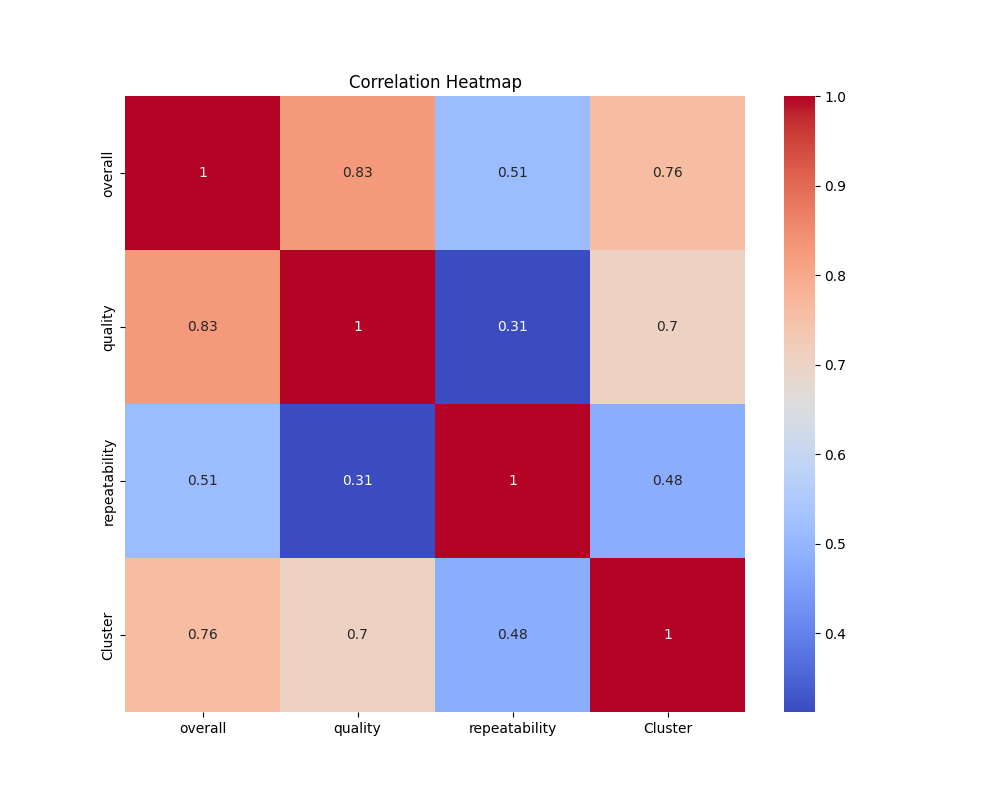

 # Analysis Report on ‘media.csv’

## Dataset Overview

The dataset 'media.csv' consists of 2,652 rows and 8 columns, revealing a snapshot of various media titles evaluated for their quality, overall rating, repeatability, language, and more. With a focus on movies, this dataset is instrumental for understanding trends in media rating across various dimensions.

### Column Information

The columns in the dataset are as follows:

1. **date**: The release date of the media title.
2. **language**: The language in which the media is produced.
3. **type**: The medium type, primarily movies in this dataset.
4. **title**: The title of the media work.
5. **by**: The actors or creators associated with the media.
6. **overall**: An overall rating of the media title (out of 5).
7. **quality**: A quality rating given to each media title (out of 5).
8. **repeatability**: A measure of how likely the audience is to engage with the media again (out of 3).

### Summary Statistics

The dataset showcases the following summary statistics:

- **Missing Values**: Notably, the 'date' column has 99 missing entries while the 'by' column has 262 missing entries. The presence of missing values indicates potential gaps in data collection, particularly in essential details like who created or starred in certain media.
  
- **Unique Values**:
    - The 'language' column exhibits 11 distinct languages, with English being the most frequent, appearing 1,306 times in the dataset.
    - The 'type' column predominantly presents as 'movie' with 2,211 instances.
  
- **Ratings**:
    - The average 'overall' rating is approximately 3.05, indicating a moderate reception of the media in the dataset. 
    - In terms of 'quality,' the average rating is slightly higher, about 3.21, possibly reflecting deeper content satisfaction.
    - The 'repeatability' average is 1.49, suggesting that most titles are not repeated frequently by audiences, as it is measured out of 3.

### Insights from the Data

Upon analyzing the dataset, several insights emerged:

1. **Diversity in Media Language**: Although English dominates, the dataset includes a range of languages, indicating the potential for a rich mix of media. This diversity may appeal to multilingual audiences.

2. **Temporal Trends**: With available release dates ranging from earlier entries to future expectations (like the titles dated in November 2024), there’s an evident interest in monitoring media longevity and popularity over time.

3. **Quality and Ratings**: The correlation matrix revealed a strong relationship between overall ratings and quality at 0.83, suggesting higher-quality titles are likely to receive better overall ratings. The lower correlation with repeatability (0.31) implies quality does not necessarily translate to repeated viewership.

4. **Outlier Presence**: The presence of 1,216 outliers in the 'overall' rating column signifies that approximately 46% of entries either excelled or failed remarkably compared to typical ratings. This suggests the existence of both outstanding and poorly received media.

5. **Clustering Analysis**: Implementing a K-Means clustering yielded two distinct groups of media titles, indicating either varying levels of quality and appeals, or different audience responses.

### Observations and Implications

The analysis paints a compelling narrative of media consumption patterns. The robust presence of high and low ratings suggests that audiences are polarized in their preferences, which could inform producers, distributors, and marketers about the potential areas for improvement or focus.

The clusters formed via K-Means suggest strategies for targeted marketing. For instance, the first cluster, potentially characterized by well-rated and widely accepted films, might benefit from expansive advertising, while those in the second could require creative rebranding or improved storytelling.

### Conclusion

In summary, the analysis of 'media.csv' reveals critical insights about media offerings, market acceptance, and audience engagement. The diversity of languages and the variance in ratings suggest a complex landscape where differing audience tastes play a crucial role. Moving forward, media producers and marketers can leverage these insights to enhance content creation, distribution strategies, and target their messaging effectively. Addressing the missing values would also enable a comprehensive understanding, allowing them to connect more authentically with audiences. Overall, this dataset serves as a valuable tool for deciphering the media landscape.

## Visualizations

### Correlation Heatmap

### KMeans Clustering Plot

